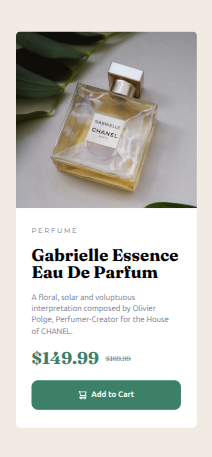

# Frontend Mentor - Product preview card component solution

This is a solution to the [Product preview card component challenge on Frontend Mentor](https://www.frontendmentor.io/challenges/product-preview-card-component-GO7UmttRfa). Frontend Mentor challenges help you improve your coding skills by building realistic projects. 

## Table of contents

- [Frontend Mentor - Product preview card component solution](#frontend-mentor---product-preview-card-component-solution)
  - [Table of contents](#table-of-contents)
  - [Overview](#overview)
    - [The challenge](#the-challenge)
    - [Screenshot](#screenshot)
    - [Links](#links)
  - [My process](#my-process)
    - [Built with](#built-with)
    - [What I learned](#what-i-learned)
    - [Continued development](#continued-development)
    - [Useful resources](#useful-resources)
  - [Author](#author)

## Overview

### The challenge

Users should be able to:

- View the optimal layout depending on their device's screen size
- See hover and focus states for interactive elements

### Screenshot





### Links

- Solution URL: [GitHub](https://github.com/adamskiee-frontendmentor-projects/product-preview-card)
- Live Site URL: [Website](https://adamskiee-frontendmentor-projects.github.io/product-preview-card/)

## My process

### Built with

- Semantic HTML5 markup
- Flexbox
- CSS Grid
- Mobile-first workflow
- [Tailwind](https://tailwindcss.com/) - Tailwind CSS


### What I learned

1. Mobile-first approach
```html
<main class="max-w-xs w-full bg-white flex flex-col rounded-lg min-desktop:grid min-desktop:grid-cols-2 min-desktop:max-w-xl">...</main>
```

2. Customization
```js
theme: {
  extend: {
    screens: {
      'min-desktop': '768px',
    },
    colors: {
      'black': 'var(--black)',
      'grey': 'var(--grey)',
      'cream': 'var(--cream)',
      'white': 'var(--white)',
      'green-500': 'var(--green-500)',
      'green-700': 'var(--green-700)'
    },
    fontFamily: {
      montserrat: ['Montserrat', 'sans-serif'],
      fraunces: ['Fraunces', 'serif'],
    },
    fontSize: {
      'dekstop-p': '.91rem', 
    }
  },
},
```

### Continued development

1. I want to learn more about how Tailwind CSS used in real world application

2. I want to learn how can i make the website responsive using Tailwind CSS


### Useful resources

- [Tailwind](https://tailwindcss.com/) - This help to style my website as it has clear documentation that is perfect for developers.
- [W3schools](https://www.w3schools.com/) and [MDN Web Docs](https://developer.mozilla.org/) - This keeps me going even if i forgot some CSS concepts.

## Author

- GitHub - [Adamskieee](https://github.com/Adamskiee)
